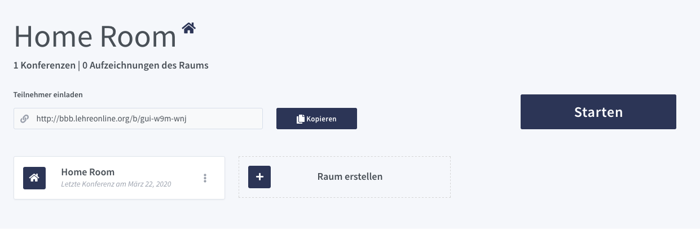
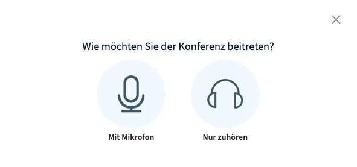
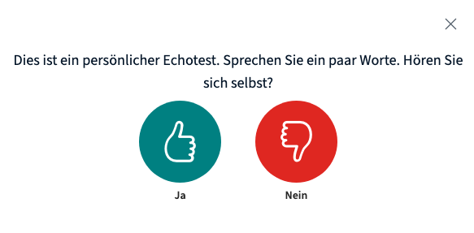
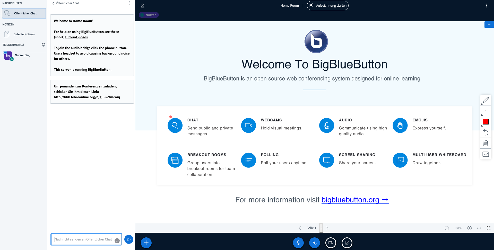
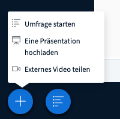
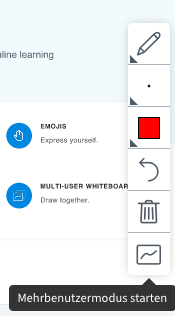
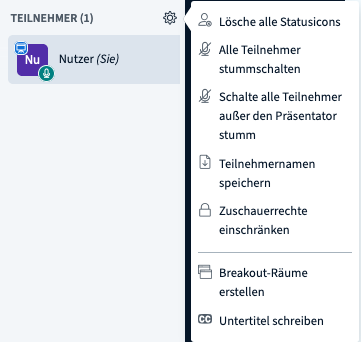
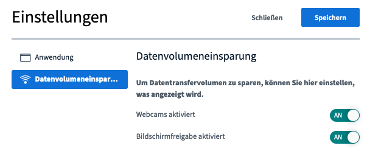

Nachdem Du es (hoffentlich) geschafft hast, [mit Hilfe unserer Beschreibung](../bbb) Deine eigene Serverinfrastruktur aufzusetzen und die Greenlight Oberflächen zu starten, ist es nun an der Zeit, für die erste Online-Sitzung. An dieser Stelle wollen wir Dich daher mit einigen zentralen Funktionen von BigBlueButton vertraut machen.

Gebe zunächst die Adresse Deines BigBlueButton Servers in Deinem Browser ein (z.B. [bbb.lehreonline.org](https://bbb.lehreonline.org)). Du solltest folgende Seite sehen:

Logge Dich mit Deinem erstellten Nutzerkonto ein. Folgende Startseite erscheint:

Normalerweise reicht es nun, den **Link** für deinen digitalen Raum zu **kopieren**, an die Teilnehmer\*innen zu **verschicken** und mit einem Klick auf `Starten` bzw. `Teilnehmen` die **Sitzung zu beginnen**. Falls Du übrigens vorher die Sprache ändern möchtest, kannst Du dies mit einem Klick auf Deinen Benutzernamen tun, wo sich unter "Profil" u.a. auch die Spracheinstellungen bearbeiten lassen. 

**Vor der ersten Sitzung** ist es allerdings empfehlenswert, zunächst eine Sitzung ohne Teilnehmer\*innen zu  starten, um sich mit den Funktionen von BigBlueButton vertraut zu machen. Wenn das nicht reicht,  finden sich [hier](https://bigbluebutton.org/html5/) zudem hilfreiche (englische) Einführungsvideos. 

Sobald Du einen digitalen Raum startest (und auch wenn sich die anderen Teilnehmer\*innen anmelden), öffnet sich folgendes Popup-Fenster, in dem man auswählen muss, wie man der Konferenz bzw. der Sitzung beitreten will.

Als Administrator wählen wir hier natürlich das Mikrofon aus. An dieser Stelle müssen wir im Webbrowser in der Regel noch bestätigen, dass BigBlueButton auf das Mikrofon zugreifen darf. Danach öffnet sich ein weiteres Fenster, in dem  wir bestätigen, dass der Sound funktioniert:

Nun gelangen wir auf die `Startseite`, auf der wir die verschiedenen Optionen ausprobieren können:

Unten in der Mitte findest Du eine `Hauptkonsole` mit den wichtigsten Funktionen: 

Hier kannst Du sowohl Dein Mikrofon als auch Deine Kamera an- und ausstellen. Wenn Du das erste Mal die Kamera einschaltest, musst Du wieder bestätigen, dass BigBlueButton darauf zugreifen darf. 

Neben diesen zentralen Funktionen, bietet BigBlueButton viele verschiedene Möglichkeiten, Materialen in eine Sitzung mit einzubauen und das Seminar oder den Unterricht interaktiv zu gestalten.

So besteht beispielsweise die Möglichkeit, Deinen gesamten Bildschirm oder aber auch nur ein einzelnes Programm mit den Teilnehmer\*innen zu teilen. Den entsprechenden Knopf findest Du ebenfalls in der `Hauptkonsole`. Das ist insbesondere hilfreich, wenn Du in Deinem Seminar ein anderes Programm erklären möchtest (wie es z.B. in der statistischen Methodenlehre häufig vorkommt). Anders als bei Jitsi Meet, bleibt es in diesem Fall auch weiterhin möglich, Dein Video mit den anderen Teilnehmer\*innen zu teilen, was die Sitzung eventuell "persönlicher" wirken lässt.

Sehr hilfreich ist zudem die Möglichkeit, eine Präsentation hochzuladen und mit den Teilnehmer\*innen zu teilen. Hierzu klickst Du auf das Pluszeichen unten links und wählst die Option `Eine Präsentation hochladen` aus:

Auf der folgenden Seite kannst Du Deine Präsentation ganz einfach per Drag & Drop auswählen und hochladen. Zurück auf der Startseite kannst Du Dich dann mit den Pfeiltasten durch die Präsentation manövrieren. 

Zudem besteht die Möglichkeit durch Auswahl der Zeichenwerkzeuge auf der rechten Seite Notizen und Markierungen in der Präsentation hinzuzufügen. Durch einen Klick auf den `Mehrbenutzermodus` kannst Du dies auch den anderen Teilnehmer\*innen ermöglichen, sodass der Bildschirm ähnlich einer Tafel bzw. einem Whiteboards funktioniert.

Je nach Aufbau Deines Kurses ist zudem das Umfrage-Tool hilfreich, um die Interaktivität zu erhöhen oder sich Zwischenfeedback einzuholen. Du öffnest die Umfrage wieder über einen Klick auf den `Kreuz-Button` unten links. Daraufhin öffnen sich verschiedene Möglichkeiten sowohl vordefinierte als auch benutzerdefinierte Umfragen durchzuführen. Dir bleibt zudem überlassen, ob Du das Ergebnis mit den anderen teilen möchtest oder nicht.

Abschließend ist unserer Erfahrung nach die öffentliche Chatfunktion auf der linken Seite des Bildschirms eine hilfreiche Ergänzung für den Kursablauf. Hier können Kursteilnehmer\*innen nicht nur Fragen stellen, sondern sie sich idealerweise auch schon gegenseitig beantworten, ohne dass man selbst als Kursleiter\*in eingreifen muss. Hierfür ist zudem die Erstellung sogenannter `Breakout Rooms` hilfreich, in denen die Teilnehmer\*innen sich in Kleingruppen austauschen und diskutieren können. 

Falls Dein Server wider Erwarten doch einmal überlastet sein sollte, kannst Du in den Einstellungen, zu denen du mit einen Klick auf `Optionen` in der rechten oberen Ecke gelangst, unter `Datenvolumeneinsparung` die Webcams aller Teilnehmer\*innen ausschalten.

Unter `Optionen` findest Du abschließend auch die Möglichkeit, die Sitzung für alle zu beenden.

