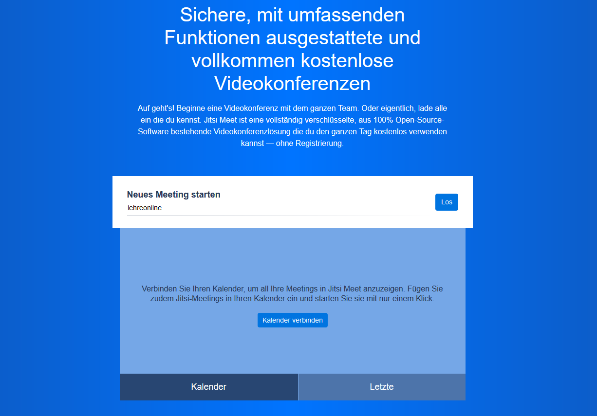
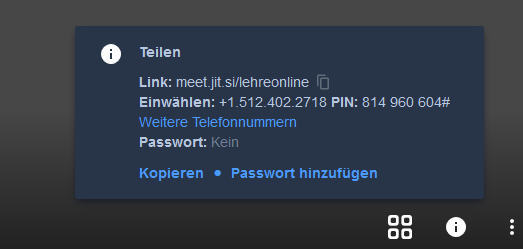

Jitsi Meet ist ein Videokonferenz-Tool und ebenso wie BigBlueButton open source (mehr dazu, was das genau heißt, findest du [hier](post/opensource)). Jitsi Meet kann entweder wie BigBlueButton auf einem [eigenen Server gehostet](https://jitsi.org/jitsi-meet/) oder kostenlos über die [Server von Jitsi](https://meet.jit.si/) genutzt werden (zu den Vor- und Nachteilen beider Lösungen siehe [ebenfalls](../opensource)). Außerdem gibt es eine App für iOS und Android sowie die Möglichkeit, Jitsi Meet in Slack einzubinden -- falls du das zum Beispiel sowieso schon im Rahmen Deiner Veranstaltung nutzt.

Für Jitsi brauchen weder Lehrende\*r noch Teilnehmende einen Account; die Anwendung wird einfach im Webbrowser geöffnet. Jitsi selbst empfiehlt die Nutzung von [Chrome](https://www.google.com/chrome/), [Firefox](https://www.mozilla.org/de/firefox/) hat unserer Erfahrung nach aber auch problemlos funktioniert -- [Safari](https://www.apple.com/safari/) allerdings nicht. Diese Information solltest Du vorab an die Teilnehmenden weitergeben; sie war bei uns in der ersten Sitzung Problemquelle Nummer 1.

Um eine Jitsi Meet-Sitzung zu starten, gibst Du einfach einen Namen für die Sitzung ein, startest die Sitzung und erlaubst Jitsi, auf Dein Mikrofon (und Deine Kamera) zuzugreifen. Am besten wählst Du einen Sitzungsnamen, der nicht zu allgemein und häufig ist, sonst kann es schon mal passieren, dass man mit wildfremden Leuten in einer Videokonferenz landet, die auf die gleiche Namensidee gekommen sind. Ansonsten kannst Du der Sitzung auch durch ein Klick auf das **i** ein Passwort zuweisen, das verhindert, dass unerwünschte Gäste an Deiner Videokonferenz teilnehmen.

Über die **i**-Schaltfläche kannst Du auch den Link zur Videokonferenz und die Zugangsdaten kopieren, um diese an die Teilnehmenden zu schicken.

Die wichtigsten Tools zur Interaktion miteinander finden sich unten links im Bildschirm. Über das Bildschirmsymbol kannst Du einzelne Fenster oder den gesamte Bildschirm übertragen (die Auswahl wird im Popup in der Adresszeile des Browsers getroffen) und die Bildschirmübertragung durch nochmaliges Klicken auf das Symbol auch wieder beenden. Mit dem Handsymbol können dir die Teilnehmenden signalisieren, dass sie gerne sprechen würden. Dieses Tool lässt sich auch wunderbar als Feedback nutzen, z.B. indem man die Teilnehmenden auffordert, die Hand zu "heben", wenn sie mit einer Aufgabe fertig sind. Mittels des Sprechblasensymbols kannst Du die Sidebar für den Chat ein- und ausblenden. Unten in der Mitte des Fensters findest Du die Schaltflächen, um Dein Mikrofon ein- und auszuschalten, die Videokonferenz zu beenden und Deine Kamera ein- und auszuschalten.

Hier noch ein paar weitere Punkte, die für einen möglichst reibungslosen Ablauf gut zu wissen sind:

- Die erste Person, die einer Sitzung beitritt ist automatisch auch der Administrator/Moderator. Um sicherzugehen, dass Du die erste Person in der Sitzung bist, kannst Du entweder den Link zur Sitzung erst kurz vor Beginn verschicken oder die Teilnehmenden bitten, sich nicht früher als bspw. 15 Minuten vor Beginn der Sitzung anzumelden.
- Da man keinen Account erstellt, erscheinen alle neuen Teilnehmenden als "Fellow Jitster" in der Videokonferenz. Jede/r kann sich durch einen Doppelklick auf den eigenen Benutzer umbenennen. Das hat auch den Vorteil, dass man alle direkt mit Namen ansprechen kann.
- Eine gleichzeitiges Teilen von Bildschirm und Video ist entgegen dessen, was auf der Jitsi-Webseite steht, (momentan) nicht möglich.
- Wir hatten ab und zu das Problem, dass Teilnehmende, die während einer Bildschirmübertragung später zur Sitzung hinzugestoßen sind, den übertragenen Bildschirm nicht sehen konnten. In diesem Fall, einfach einmal kurz die Bildschirmübertragung beenden und den Bildschirm wieder neu übertragen.
- Alle anderen technischen Probleme bei den Teilnehmenden, wie z.B. eine stehengebliebene Bildschirmübertragung oder kein Audiosignal, ließen sich bisher immer durch einen einfachen Neustart der Videokonferenz lösen.
